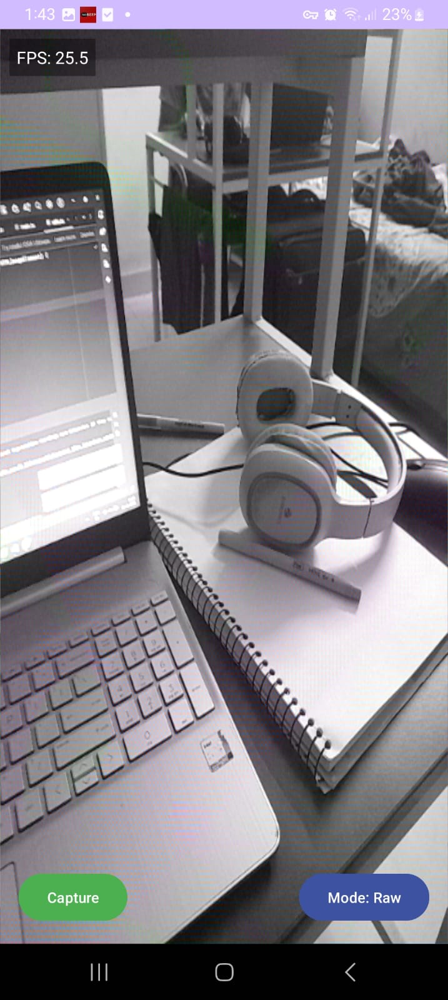

# Android + OpenCV-C++ + OpenGL + Web Assessment

## Overview
minimal Android app that captures camera frames, processes
them using OpenCV in C++ (via JNI), and displays the processed output using
OpenGL ES.Additionally, create a small TypeScript-based web page that can receive a dummy processed frame (static image or base64) and display it — to
demonstrate ability to bridge native processing results to a simple web layer.

### Screenshots / GIF of the Working App

**Android App (Camera + Edge Detection)**  
- Raw frame preview  
  

- Edge-detected frame preview  
  

**Web Viewer (Static Frame Display)**  
- Toggle between Raw and Processed frames  
  


## Performance Notes
- Resolution: 640x480 for ~30 FPS (Commit 3+6).
- Direct Mat → ByteBuffer → OpenGL pipeline significantly reduces memory allocations.
- Temporal smoothing applied optionally via JNI (Commit 7).
- Continuous rendering mode used in GLSurfaceView for smooth frame updates.

## Tech Stack
- **Android SDK (Kotlin):** Handles app UI, Camera2 API, and activity lifecycle.  
- **NDK (Native Development Kit):** Enables writing and compiling C++ code for Android.  
- **OpenGL ES 2.0+:** Renders RGBA Mats on GLSurfaceView efficiently.  
- **OpenCV (C++):** Performs image processing like YUV→RGBA conversion and Canny edge detection.  
- **JNI (Java ↔ C++ communication):** Bridges Kotlin/Java with native C++ OpenCV functions.  
- **TypeScript:** Implements a lightweight web viewer to display captured frames for debugging.  
- **GLSL shaders:** Simple vertex and fragment shaders for texture mapping in OpenGL.

## Features Implemented (Android + Web)

**Android App**
- Captures frames from the camera using Camera2 API.
- Converts frames from YUV → RGBA and optionally rotates them.
- Provides a toggle between Raw and Edge-detected frames.
- Applies Canny edge detection with exponential moving average (EMA) smoothing via JNI (C++).
- Real-time OpenGL ES 2.0 rendering using GLSurfaceView.
- FPS overlay on the UI.
- Capture button to save frames as PNG (Raw or Processed).

**Web Viewer**
- Displays captured frames exported from Android.
- Toggle button to switch between Raw and Processed frames.
- Shows frame metadata: type, resolution, and FPS (simulated).
- Minimal TypeScript + HTML viewer for debugging and visualization.

## Architecture Overview

**Frame Flow (Android)**
- CameraHelper captures frames using Camera2 API.
- Frames converted from YUV → RGBA using OpenCV.
- Optional rotation correction applied.
- Frames sent to **NativeLib (JNI / C++)** for edge detection and EMA smoothing.
- Processed Mat is forwarded to **GLRenderer** for OpenGL ES 2.0 rendering.
- Capture button saves Raw or Processed frames as PNG.

**GLRenderer & Shaders**
- GLRenderer implements **GLSurfaceView.Renderer** to render Mats on GPU.
- Uses a reusable **ByteBuffer** to upload RGBA Mat data directly to GPU.
- Vertex and fragment **GLSL shaders** map the texture to a full-screen quad.
- Ensures smooth, real-time visualization of camera frames without per-frame allocations.

**JNI / C++**
- Receives Mat pointer from Kotlin.
- Converts RGBA → Grayscale.
- Applies Canny edge detection.
- Smooths edges using exponential moving average (EMA).
- Converts back to RGBA and updates the same Mat for rendering.

**Web Viewer (TypeScript)**
- Loads static captured frames exported from Android (Raw and Processed).
- Displays frames on a canvas with overlay: frame type, resolution, FPS.
- Toggle button switches between Raw and Processed frames dynamically.


## Future Improvements
- Live streaming of frames to the web frontend.
- Additional OpenCV filters for real-time processing.
- Shader-level optimization for OpenGL rendering.
- GPU-based YUV → RGBA conversion.

## Project Directory Structure

```markdown
project-root/
│
├── app/                                        
│   ├── kotlin+java/com.example.testapp/
│   │      └── CameraHelper.kt
│   |      └── MainActivity.kt
│   |      └── NativeLib.kt
│   ├── build.gradle.kts          
│   └── res/
│         └── layout/
│                └── activity_main.xml
│       
├── gl/
│   ├── kotlin+java/com.example.gl/
│   │            └── GLRenderer.kt
│   └── build.gradle.kts
│
├── jni/
│   ├── cpp/
│   │     ├── includes/
│   │     │      └── CMakeLists.txt  
│   │     │      └── jni.cpp
│   │     └── jniLibs/     
│   └── build.gradle.kts
│            
├── OpenCV/
│
├── web/
│   ├── index.html
│   ├── src/
│   │      ├── main.ts  
│   │      └── utils.ts 
│   ├── capture_raw.png  
│   ├── capture_edges.png
│   ├── package.json
│   └── tsconfig.json
│  
└── README.md

```


## Dependencies and Build Files

### Build.gradle.kts (:app)
- **Depends on:** `:jni` and `:OpenCV`

### Build.gradle.kts (:jni)
- **Depends on:** prebuilt OpenCV native libraries (`libopencv_java4.so`)


### Build.gradle.kts (:gl)
- **Depends on:** `OpenCV`, Kotlin/Java OpenGL ES 2.0 classes

### Build.gradle.kts (:OpenCV)
- **Contains:** OpenCV Android SDK (headers and optionally Java bindings)


---
---
---
---


## Detailed Working of Each File (Optional) & also commit history:

## What each file does?

### CameraHelper.kt
- Manages Android Camera2 API for frame capture.
- Converts frames from **YUV → RGBA** using OpenCV.
- Applies optional rotation correction based on device orientation.
- Provides **reusable Mat objects** for real-time OpenGL rendering or further native processing.
- **Flow:** Camera2 API → OpenCV YUV→RGBA → rotation → reusable Mat → OpenGL.

### MainActivity.kt
- Initializes OpenCV, GLSurfaceView, and UI buttons.
- Handles UI interactions: toggle between Raw/Edge frames, capture button.
- Receives live camera frames via CameraHelper.
- Sends Mat frames to **NativeLib (C++ OpenCV)** when edge mode is enabled.
- Updates GLRenderer with processed Mat for OpenGL ES rendering.
- Saves current frame as PNG on capture.
- Updates FPS display in the overlay TextView.

### NativeLib.kt
- Provides a **bridge** from Kotlin to native C++ OpenCV code via JNI.
- Allows Mat objects to be processed **in-place** on the native side.

### main_activity.xml
- Defines a full-screen **GLSurfaceView** for **OpenGL rendering**.
- Adds a top-left **FPS overlay (TextView)**.
- Adds a bottom-right **toggle button** for **Raw/Edge mode**.
- Adds a bottom-left **capture button** for saving frames as **PNG**.

### jni.cpp
- Receives an OpenCV Mat from Kotlin via JNI.
- Converts RGBA → Grayscale.
- Applies **Canny edge detection**.
- Smooths edges using **Exponential Moving Average (EMA)**.
- Converts result back to RGBA and writes into the same Mat for **OpenGL rendering**.


### CMakeLists.txt
- This **CMakeLists.txt** sets up the **JNI (C++) library** for Android.
- Specifies the minimum **CMake** version and **project name**.
- Adds **OpenCV headers** and links the prebuilt **OpenCV shared library libopencv_java4.so**.
- Compiles **jni.cpp** into a shared library named **jni**.
- Links the JNI library with **OpenCV**, **Android**, and **log** libraries for native logging and Android API access.


### jniLibs folder
- Contains precompiled native libraries for Android.
- Includes architecture-specific folders, e.g., **arm64-v8a**, **armeabi-v7a**, **x86**, **x86_64**.
- Stores the **OpenCV shared library libopencv_java4.so** used by the JNI code.
- Ensures that the app can link and use native C++ code on the device at runtime.
- Placed under **jni/cpp/jniLibs** to be referenced in **CMakeLists.txt**.

### OpenCV
- Contains the **OpenCV Android SDK** used for computer vision operations.
- Includes header files for C++ **include/** and Java bindings **sdk/java/** if needed.
- Used by **CameraHelper.kt** and **jni.cpp** for image processing.
- Allows **YUV → RGBA conversion**, **Canny edge detection**, and other OpenCV functions.
- Integrated in the build via **CMakeLists.txt** and Gradle **implementation(project(":OpenCV"))**.

### GLRenderer.kt
- Implements **GLSurfaceView.Renderer** to render **OpenCV Mats** onto an **OpenGL ES 2.0** surface.
- Maintains a reusable **ByteBuffer** to upload RGBA Mat data directly to GPU, avoiding per-frame memory allocation.
- Uses a simple vertex and fragment shader to map textures onto a full-screen quad.
- Receives processed Mats from **MainActivity** via **CameraHelper** and **NativeLib** and updates the OpenGL texture.
- Draws the texture every frame in **onDrawFrame**, ensuring smooth visualization of raw or edge-detected camera frames.

### Web

#### index.html
- Provides a static web viewer to display frames captured from Android (**Raw** or **Processed**).
- Uses a **canvas element frameCanvas** to render the images.
- Displays overlay information: **Frame Type**, **FPS** (simulated), and **Resolution**.
- Includes a toggle button **toggleBtn** to switch between Raw and Processed frames.
- Loads the main TypeScript/JS module **main.js** to handle DOM updates and frame rendering.

#### main.ts
- Imports a helper function **drawImageOnCanvas** to render images on canvas.
- Loads two static images captured from Android: **Raw capture_raw.png** and **Processed capture_edges.png**.
- Sets up the canvas size dynamically to match the image dimensions.
- Draws the current frame and updates overlay info: **Frame Type**, **FPS**, and **Resolution**.
- Implements a toggle button to switch between Raw and Processed frames.
- Ensures both images are fully loaded before the first render.

#### utils.ts (Canvas Drawing Helper)
- Exports **drawImageOnCanvas()** function to render an **HTMLImageElement** on a canvas.
- Clears the previous canvas content before drawing the new image.
- Draws the image at its original size without scaling or distortion.


## Features by Commits

### **Commit 1: Initial Android Setup**
- Integrated camera feed using Camera2 API with TextureView.
- Created JNI/C++ structure for frame processing with OpenCV.
- Verified OpenCV initialization and runtime camera permission handling.
- Created basic UI with `TextureView`.

### **Commit 2: OpenGL ES Integration**
- Added `GLRenderer.kt` to render OpenCV-processed frames on `GLSurfaceView`.
- Updated `MainActivity.kt` and `CameraHelper.kt` to forward frames to GLRenderer.
- Frames displayed in real-time via OpenGL ES 2.0.
- Known issue: Frames rotated 90° left.

### **Commit 3: Corrected Frame Rotation**
- Implemented rotation logic in `CameraHelper.kt` to correct orientation.
- Added FPS tracking in `MainActivity.kt`.
- Reduced camera resolution to 640x480 → ~23 FPS.
- Ensured rotation works for all device orientations.

### **Commit 4: UI Creation**
- Added UI for FPS display.
- Connected FPS TextView with frame processing.

### **Commit 5: Continuous Rendering Mode**
- Changed `GLSurfaceView` render mode from `RENDERMODE_WHEN_DIRTY` to `RENDERMODE_CONTINUOUSLY` for smoother updates.
- Performance notes: Minor optimizations possible for higher FPS.

### **Commit 6: Optimized Frame Pipeline**
- Eliminated Bitmap/JPEG conversions → no per-frame memory copies.
- Reused Mats and ByteBuffers for direct YUV → RGBA conversion.
- Direct upload to OpenGL using `ByteBuffer`.
- Achieved higher FPS and reduced GC pressure.
- Flowchart (Pipeline):
  Previous Pipeline: Camera(YUV) → Bitmap → Mat → GLRenderer → OpenGL
  Optimized Pipeline: Camera(YUV) → Mat → ByteBuffer → GLRenderer → OpenGL

### **Commit 7: Temporal Smoothing**
- Applied EMA (Exponential Moving Average) in `jni.cpp`.
- Smoothed processed frames to reduce flicker and noise.

### **Commit 8: Toggle Button for Frame Type**
- Added toggle button in Android UI for Raw vs Processed frames.
- Updated `GLRenderer` to display frame type based on toggle state.
- Frames are captured and processed from Android; toggle only changes display.

### **Commit 9: Web Viewer**
- Integrated a web frontend (TypeScript + HTML) to display captured Android frames.
- Displays both Raw and Processed frames with a toggle button.
- Overlay shows Frame number, Frame Type, FPS, and Resolution.
- DOM manipulations occur on toggle; frames are static captures (not live feed).

## License
MIT License

